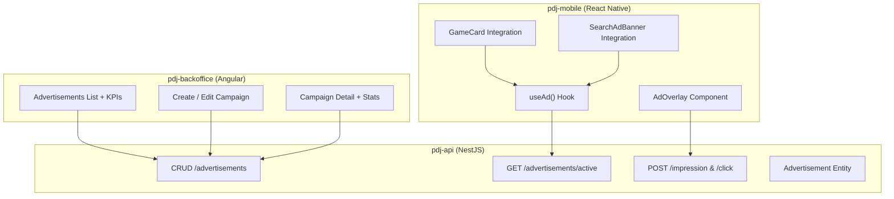

# 🎯 Plan d'implémentation — Système de Publicité (PUB)

## Contexte & Règles Métier

| Règle | Détail |
|---|---|
| **Audience cible** | Utilisateurs gratuits uniquement (`subscription.hasAdvertisement === true`) |
| **Exclusions** | Restaurateurs (`role === RESTAURANT`) et membres Premium → jamais de pub |
| **Déclencheur 1** | Avant chaque mini-jeu : roue, boîte mystère, quiz |
| **Déclencheur 2** | Ponctuel lors de l'utilisation du moteur de recherche |
| **Ton** | Friction légère, facilement fermable, jamais harcelant |
| **Flag existant** | `TSubscription.hasAdvertisement: boolean` (déjà en DB, default `true`) |

> [!IMPORTANT]
> L'objectif est d'inciter à l'abonnement Premium **sans dégrader** l'expérience gratuite. Les pubs doivent être modérées, stratégiquement placées, et toujours facilement fermables.

---

## Architecture Globale



---

## Phase 1 — API (`pdj-api`)

### 1.1 Entity `Advertisement`

**Fichier :** `src/advertisements/entities/advertisement.entity.ts`

```ts
@Entity()
export class Advertisement {
  @PrimaryGeneratedColumn('uuid')
  id: string;

  @Column()
  title: string;

  @Column({ nullable: true })
  description: string;

  @Column({ nullable: true })
  imageUrl: string;                    // URL complète (APP_URL + uploads)

  @Column({ nullable: true })
  ctaLabel: string;                    // ex: "Passer à Premium"

  @Column({ nullable: true })
  ctaUrl: string;                      // deeplink ou URL externe

  @Column({ type: 'enum', enum: AdContext, default: 'both' })
  context: AdContext;                  // 'game' | 'search' | 'both'

  @Column({ default: 3 })
  closableAfterSeconds: number;        // 0 = fermable immédiatement

  @Column({ default: true })
  isActive: boolean;

  @Column({ default: false })
  isDeleted: boolean;

  @Column({ default: 0 })
  impressionsCount: number;            // incrémenté côté API

  @Column({ default: 0 })
  clicksCount: number;

  @Column({ type: 'timestamp', default: () => 'CURRENT_TIMESTAMP' })
  createdAt: Date;

  @Column({ type: 'timestamp', default: () => 'CURRENT_TIMESTAMP' })
  updatedAt: Date;
}
```

**Enum :** `src/enums/adContext.enum.ts`

```ts
export enum AdContext {
  GAME = 'game',
  SEARCH = 'search',
  BOTH = 'both',
}
```

### 1.2 Module Structure

```
src/advertisements/
├── entities/
│   └── advertisement.entity.ts
├── dto/
│   ├── create-advertisement.dto.ts
│   └── update-advertisement.dto.ts
├── advertisements.controller.ts
├── advertisements.service.ts
└── advertisements.module.ts
```

### 1.3 API Endpoints

| Méthode | Route | Auth | Description |
|---|---|---|---|
| `GET` | `/advertisements` | Admin | Liste toutes les campagnes (pagination) |
| `POST` | `/advertisements` | Admin | Créer (multipart: image upload) |
| `GET` | `/advertisements/:id` | Admin | Détail + stats |
| `PATCH` | `/advertisements/:id` | Admin | Modifier |
| `DELETE` | `/advertisements/:id` | Admin | Soft delete |
| `PATCH` | `/advertisements/:id/toggle` | Admin | Toggle `isActive` |
| `GET` | `/advertisements/active` | Public | Retourne 1 pub aléatoire active filtrée par contexte |
| `POST` | `/advertisements/:id/impression` | Public | Incrémente `impressionsCount` |
| `POST` | `/advertisements/:id/click` | Public | Incrémente `clicksCount` |
| `GET` | `/advertisements/stats` | Admin | KPIs agrégées (totales, actives, impressions, clics, CTR) |

**Endpoint clé — `GET /advertisements/active?context=game`**

```ts
// Logique :
// 1. Filtre: isActive = true, isDeleted = false
// 2. Filtre: context = paramContext OU context = 'both'
// 3. Sélection aléatoire parmi les résultats
// 4. Retourne 1 ad ou null
```

### 1.4 DTOs

**`CreateAdvertisementDto`**
```ts
{
  title: string;            // requis
  description?: string;
  ctaLabel?: string;
  ctaUrl?: string;
  context?: AdContext;      // default: 'both'
  closableAfterSeconds?: number;  // default: 3
  isActive?: boolean;       // default: true
}
// + image via Multer (optionnel)
```

---

## Phase 2 — Mobile (`pdj-mobile`)

### 2.1 Type `TAdvertisement`

**Fichier :** `shared/models/advertisement.ts`

```ts
export type TAdvertisement = {
  id: string;
  title: string;
  description: string | null;
  imageUrl: string | null;
  ctaLabel: string | null;
  ctaUrl: string | null;
  context: 'game' | 'search' | 'both';
  closableAfterSeconds: number;
  isActive: boolean;
};
```

> Ajouter l'export dans `shared/models/index.ts`

### 2.2 Hook `useAd` — Logique centralisée

**Fichier :** `shared/hooks/useAd.ts`

```
Responsabilités :
1. Détermine si l'utilisateur doit voir des pubs (session + subscription)
2. Expose triggerAd(context) → fetch l'API → affiche l'overlay
3. Gère le state visible/currentAd
4. Expose dismiss() pour fermer
5. Compteur de recherches pour la fréquence search
```

**Règle de décision :**
```
shouldShowAds =
  user.role.name !== 'RESTAURANT'
  AND user.membership?.subscription?.hasAdvertisement === true
```

> [!NOTE]
> `hasAdvertisement = true` signifie "l'utilisateur voit des pubs" (c'est un flag du plan gratuit). Les plans Premium ont `hasAdvertisement = false`.

### 2.3 Composant `AdOverlay` — Modal plein écran

**Fichier :** `shared/components/AdOverlay.tsx`

```
┌─────────────────────────────────┐
│                    Fermer dans 3s│  ← compteur + bouton X
│                                 │
│   ┌─────────────────────────┐   │
│   │                         │   │
│   │   [Image de la pub]     │   │
│   │                         │   │
│   └─────────────────────────┘   │
│                                 │
│   Titre de la campagne          │
│   Description optionnelle       │
│                                 │
│   ┌─────────────────────────┐   │
│   │  ✨ Passer à Premium    │   │  ← CTA (si configuré)
│   └─────────────────────────┘   │
│                                 │
└─────────────────────────────────┘
```

**Comportement :**
- Slide-up animation
- Timer visible : bouton "X" grisé pendant `closableAfterSeconds`, puis actif
- Compteur : "Fermer dans 3… 2… 1…"
- CTA optionnel : ouvre un deeplink vers la page Premium ou URL externe
- Appel `/impression` à l'affichage, `/click` si CTA appuyé

### 2.4 Intégration Mini-Jeux

**Fichiers à modifier :** `features/hub/` — les écrans/composants qui lancent les jeux

**Flux :**
```
[User appuie "Lancer / Ouvrir / Démarrer"]
         │
         ▼
  useAd.triggerAd("game")
         │
    shouldShowAds ?
    ┌────┴────┐
   OUI      NON
    │          └──→ Lancement du jeu immédiat
    ▼
  Fetch GET /advertisements/active?context=game
         │
    Pub trouvée ?
    ┌────┴────┐
   OUI      NON
    │          └──→ Lancement du jeu immédiat
    ▼
  AdOverlay visible
  POST /impression
         │
  [User ferme après le timer]
         │
         ▼
  Lancement du jeu
```

> [!TIP]
> La navigation vers le jeu doit attendre le `onDismiss` du composant. Passer un callback `onComplete` au hook.

### 2.5 Intégration Recherche

**Fichier à modifier :** `features/search/` — écran de résultats

**Principe :** Bannière inline (non-bloquante) entre les résultats de recherche.

**Fréquence :** 1 bannière toutes les **3 recherches** (compteur en mémoire dans le hook).

```
┌─────────────────────────────────────────────────┐
│  📢  Sponsorisé                            [✕]  │
│                                                 │
│  Passez à Premium — recherche sans pub !        │
│                                    [En savoir +]│
└─────────────────────────────────────────────────┘
```

**Composant :** `shared/components/SearchAdBanner.tsx`
- Inline dans la FlatList des résultats
- Facilement fermable (bouton X)
- Design subtil, pas de modal bloquant
- CTA optionnel vers la page Premium

---

## Phase 3 — Backoffice (`pdj-backoffice`)

### 3.1 Structure fichiers

```
src/app/features/advertisements/
├── advertisements.ts              ← liste + KPIs
├── advertisements.html
├── advertisements.scss
├── create-advertisement/
│   ├── create-advertisement.ts    ← page création
│   ├── create-advertisement.html
│   └── create-advertisement.scss
└── advertisement-detail/
    ├── advertisement-detail.ts    ← détail + stats + édition
    ├── advertisement-detail.html
    └── advertisement-detail.scss
```

### 3.2 Service Angular

**Fichier :** `src/app/core/services/advertisement.service.ts`

```ts
// Méthodes :
findAll():           Observable<{ advertisements: Advertisement[] }>
findOne(id):         Observable<{ advertisement: Advertisement }>
create(fd):          Observable<{ advertisement: Advertisement }>  // FormData pour image
update(id, payload): Observable<{ advertisement: Advertisement }>
remove(id):          Observable<any>
toggleActive(id):    Observable<{ advertisement: Advertisement }>
getStats():          Observable<{ stats: AdvertisementStats }>
```

### 3.3 Page Liste — KPIs

| KPI | Icône | Couleur |
|---|---|---|
| **Campagnes actives** | 📢 | Bleu |
| **Impressions totales** | 👁 | Vert |
| **Clics CTA totaux** | 🖱 | Orange |
| **CTR moyen** | 📊 | Violet |

### 3.4 Page Liste — Tableau

| Colonne | Type |
|---|---|
| Image + Titre | Thumb + texte |
| Contexte | Badge: `Jeu` / `Recherche` / `Les deux` |
| Statut | Badge actif/inactif |
| Timer | `Xs` (closableAfterSeconds) |
| Impressions | Nombre |
| Clics | Nombre |
| CTR | % calculé |
| Actions | Modifier · Supprimer |

Clic sur la ligne → page détail.

### 3.5 Page Création

**Route :** `/app/advertisements/create`

Formulaire wizard avec :
- Titre (requis), Description
- Contexte : radio `Jeu` / `Recherche` / `Les deux`
- Upload image (cover)
- CTA Label + CTA URL (optionnel)
- Timer de fermeture (slider ou input nombre, 0-10s)
- Toggle "Activer immédiatement"

### 3.6 Page Détail

**Route :** `/app/advertisements/:id`

- Bannière avec preview de l'image
- Infos principales (titre, description, contexte, timer, statut)
- **Stats card** : impressions, clics, CTR, courbe temporelle (si tracking avancé)
- Actions : Modifier, Désactiver/Activer, Supprimer

### 3.7 Routes

```ts
// Dans app.routes.ts — sous le path 'app'
{
  path: 'advertisements',
  canActivate: [roleGuard('ADMIN')],
  loadComponent: () =>
    import('./features/advertisements/advertisements')
      .then(m => m.Advertisements),
},
{
  path: 'advertisements/create',
  canActivate: [roleGuard('ADMIN')],
  loadComponent: () =>
    import('./features/advertisements/create-advertisement/create-advertisement')
      .then(m => m.CreateAdvertisement),
},
{
  path: 'advertisements/:id',
  canActivate: [roleGuard('ADMIN')],
  loadComponent: () =>
    import('./features/advertisements/advertisement-detail/advertisement-detail')
      .then(m => m.AdvertisementDetail),
},
```

### 3.8 Sidebar

Ajouter l'entrée dans le layout (réservée ADMIN) :

```
📢  Publicités    →  /app/advertisements
```

Position : entre "Mini-Jeux" et "Statistiques".

---

## Ordre d'implémentation

```mermaid
gantt
    title Phases d'implémentation — Pub System
    dateFormat X
    axisFormat %s

    section Phase 1 — API
    Enum AdContext                  :p1a, 0, 1
    Entity Advertisement           :p1b, 1, 2
    DTOs + Validation              :p1c, 2, 3
    Service CRUD                   :p1d, 3, 5
    Controller + Routes            :p1e, 5, 7
    Image upload (Multer)          :p1f, 7, 8
    Endpoint /active               :p1g, 8, 9
    Endpoints tracking             :p1h, 9, 10

    section Phase 2 — Backoffice
    Service Angular                :p2a, 10, 11
    Liste + KPIs                   :p2b, 11, 14
    Page création                  :p2c, 14, 17
    Page détail + stats            :p2d, 17, 19
    Routes + Sidebar               :p2e, 19, 20

    section Phase 3 — Mobile
    Type TAdvertisement            :p3a, 10, 11
    Hook useAd                     :p3b, 11, 13
    AdOverlay component            :p3c, 13, 16
    Intégration GameCard           :p3d, 16, 18
    SearchAdBanner component       :p3e, 18, 20
    Intégration Search             :p3f, 20, 22
    Tracking impression/click      :p3g, 22, 23
```



> [!TIP]
> Les phases 2 (Backoffice) et 3 (Mobile) peuvent être développées **en parallèle** puisqu'elles dépendent uniquement de l'API (Phase 1).

---

## Points de Décision

> [!IMPORTANT]
> Les éléments suivants nécessitent validation avant implémentation :

| # | Question | Suggestion |
|---|---|---|
| 1 | **Timer de fermeture par défaut** | 3 secondes |
| 2 | **Fréquence pub recherche** | 1 pub toutes les 3 recherches |
| 3 | **Hébergement images** | Même serveur (`/uploads/advertisements/`) comme les events |
| 4 | **CTA mobile** | Deeplink vers page Premium in-app |
| 5 | **Tracking** | Impression envoyée au mount de l'overlay, clic au tap CTA |
| 6 | **Priorité** | Backoffice d'abord (pour pouvoir créer des campagnes) puis Mobile |
