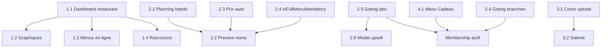

# Plan d'implémentation — Parité Backoffice Restaurant / Mobile

> **Objectif :** Aligner le backoffice web (`pdj-backoffice`) sur les fonctionnalités déjà disponibles pour le rôle `RESTAURANT` dans l'app mobile (`pdj-mobile`).
>
> **Comment utiliser ce document :** Cochez `- [x]` chaque feature une fois implémentée et testée. Mettez à jour la date dans le tableau de progression.
>
> **Référence mobile :** `pdj-mobile/features/restaurant-profile/`, `pdj-mobile/features/home/components/restaurant/`, `pdj-mobile/app/(tabs)/planning/`
>
> **Référence backoffice :** `pdj-backoffice/src/app/features/`, guards `roleGuard('RESTAURANT')` dans `app.routes.ts`

---

## Progression globale

| Statut | Count |
|--------|------:|
| Total features | 19 |
| Done | 18 |
| In progress | 0 |
| Remaining | 0 |
| Hors scope (web) | 1 |

**Dernière mise à jour :** 2026-06-15

### Checklist rapide

| ID | Feature | Statut |
|----|---------|--------|
| 1.1 | Dashboard restaurant dédié | ✅ Done |
| 1.2 | Graphiques performance 7 jours | ✅ Done |
| 1.3 | Menus en ligne (dashboard) | ✅ Done |
| 1.4 | Raccourcis rapides | ✅ Done |
| 2.1 | Planning hebdomadaire | ✅ Done |
| 2.2 | Aperçu client du menu | ✅ Done |
| 2.3 | Prix auto-calculé | ✅ Done |
| 2.4 | Toggle `isFullMenuMandatory` | ✅ Done |
| 2.5 | Gating abonnement menus | ✅ Done |
| 2.6 | Modal upsell premium | ✅ Done |
| 3.1 | Upload image de couverture | ✅ Done |
| 3.2 | Galerie photos restaurant | ✅ Done |
| 3.3 | Suppression restaurant | ✅ Done |
| 3.4 | Gating branches / itinérant | ✅ Done |
| 4.1 | Menu Cadeau | ✅ Done |
| 4.2 | Scan carte membership | 🚫 Hors scope web |
| 5.1 | Infos personnelles | ✅ Done |
| 5.2 | Changement mot de passe | ✅ Done |
| 5.3 | Page paramètres | ✅ Done |
| 5.4 | Notifications | ✅ Done |
| 5.5 | Picker multi-établissement | ✅ Done |

**Prochaine feature recommandée :** Parité complète — toutes les features in-scope sont implémentées.

---

## Hors scope web (mobile uniquement)

| Feature | Décision |
|---------|----------|
| **4.2 Vérification carte (scan QR)** | Non implémenté sur le backoffice — réservé à l'app mobile (`ScanCardScreen.tsx`). Pas de saisie manuelle ni scan webcam prévu. |

---

## Déjà en parité (ne pas re-implémenter)

Ces zones existent déjà sur le backoffice et couvrent l'équivalent mobile :

- [x] **Plats (CRUD)** — `/app/dishes` (+ create, edit, detail)
- [x] **Menus (CRUD de base)** — `/app/menus` (+ detail, sections Today / Upcoming / Past / Models)
- [x] **Localisations** — `/app/locations` (fixe + itinérant weekly plan)
- [x] **Mes restaurants** — `/app/my-restaurants` (vue principale + branches)
- [x] **Gérer le restaurant (texte)** — `/app/manage-restaurant` (profil, réservations, horaires)
- [x] **Abonnement & factures** — `/app/membership` (plans, souscription, invoices)
- [x] **Auth** — login, mot de passe oublié / reset

---

## Phase 1 — Dashboard & analytics (Priorité haute)

### 1.1 Dashboard restaurant dédié

- [x] **Feature : Dashboard restaurant dédié**

| | |
|---|---|
| **Problème** | Le dashboard actuel (`/app/dashboard`) affiche des KPIs plateforme (total users, total restaurants) pour tous les rôles. |
| **Mobile** | `RestaurantHomeScreen.tsx` — stats 7 jours, menus en ligne, raccourcis |
| **Backoffice cible** | `features/dashboard/` — branchement sur `AuthService.isRestaurant` |
| **API** | `GET /statistics` → `{ views, clicks }` (restaurant role) |
| **Fichiers à modifier** | `dashboard.ts`, `dashboard.html`, `dashboard.service.ts`, `layout.ts` (nav label si besoin) |
| **Critères d'acceptation** | Un utilisateur `RESTAURANT` voit uniquement ses vues/clics (7 derniers jours), pas les stats globales admin. Un `ADMIN` conserve le dashboard actuel. |
| **Fichiers implémentés** | `features/dashboard/dashboard.ts`, `dashboard.html`, `dashboard.scss`, `core/services/dashboard.service.ts` |

---

### 1.2 Graphiques de performance (vues & clics)

- [x] **Feature : Graphiques de performance 7 jours**

| | |
|---|---|
| **Mobile** | `PerformanceState.tsx`, `ChartCard.tsx`, `BarChartComponent.tsx` |
| **Backoffice cible** | Section dashboard restaurant avec 2 cartes + bar chart |
| **API** | `GET /statistics` (même endpoint) |
| **Critères d'acceptation** | Graphiques views et clicks sur 7 jours, libellés FR/EN via i18n, état vide si pas de données. |
| **Fichiers implémentés** | `features/dashboard/dashboard.html` (section `performance-cards`) |

---

### 1.3 Liste des menus en ligne sur le dashboard

- [x] **Feature : Menus en ligne sur le dashboard**

| | |
|---|---|
| **Mobile** | `OnlineMenuCard.tsx` + `useGetRestaurantMenus` |
| **Backoffice cible** | Bloc « Menus du jour » sur le dashboard restaurant |
| **API** | `GET /menus/{restaurantId}/restaurants` (filtrer date = aujourd'hui, non supprimés) |
| **Critères d'acceptation** | Affiche les menus publiés pour aujourd'hui avec lien vers `/app/menus/:id`. |
| **Fichiers implémentés** | `features/dashboard/dashboard.ts` (bloc `onlineMenus`) |

---

### 1.4 Raccourcis rapides dashboard

- [x] **Feature : Raccourcis rapides**

| | |
|---|---|
| **Mobile** | `ShortCutManagement.tsx` — scan, créer plat, établissement, géo |
| **Backoffice** | Planning, créer plat, établissement, géo *(scan exclu — mobile only)* |
| **Routes cibles** | Planning → `/app/planning` ; Plat → `/app/dishes/create` ; Établissement → `/app/manage-restaurant` ; Géo → `/app/locations` |
| **Critères d'acceptation** | 4 raccourcis cliquables, visibles uniquement pour `RESTAURANT`. |
| **Fichiers implémentés** | `features/dashboard/dashboard.ts` (shortcuts → Planning, Dishes, Manage restaurant, Locations) |

---

## Phase 2 — Menus (Priorité haute)

### 2.1 Vue planning hebdomadaire

- [x] **Feature : Calendrier planning hebdomadaire**

| | |
|---|---|
| **Problème** | Le backoffice groupe par Today/Upcoming/Past mais sans navigation semaine par semaine. |
| **Mobile** | `app/(tabs)/planning/index.tsx`, `PlanningHeader.tsx`, `MenusCard.tsx` |
| **Backoffice cible** | Route `/app/planning` |
| **API** | `GET /menus/{restaurantId}/restaurants` + filtrage client par semaine |
| **Critères d'acceptation** | Navigation prev/next semaine, menus groupés par jour (Aujourd'hui / Demain / date), bouton Éditer → menu detail/edit, CTA Ajouter un menu. |
| **Fichiers implémentés** | `features/planning/planning.ts`, `planning.html`, `planning.scss`, `planning-date.utils.ts`, route + nav `NAV.PLANNING` |

---

### 2.2 Aperçu client du menu

- [x] **Feature : Aperçu client avant publication**

| | |
|---|---|
| **Mobile** | `menuPreview.tsx`, `MenuCustomerPreview.tsx` |
| **Backoffice cible** | Modal preview dans create/edit menu + détail menu |
| **Critères d'acceptation** | Preview fidèle au rendu client (nom, prix, plats, restaurant), accessible avant submit. |
| **Fichiers implémentés** | `features/menus/menu-customer-preview/`, `menu-preview-modal/`, `build-draft-menu.util.ts`, intégration `menus.ts` + `menu-detail.ts` |

---

### 2.3 Prix auto-calculé depuis les plats

- [x] **Feature : Prix auto-calculé**

| | |
|---|---|
| **Mobile** | `build-draft-menu.ts` — somme des prix appetizer + main + dessert |
| **Backoffice cible** | `menus.ts`, `menu-detail.ts` — recalcul à la sélection des plats |
| **Critères d'acceptation** | Le champ prix se met à jour automatiquement ; l'utilisateur peut encore le modifier manuellement (optionnel). |

---

### 2.4 Option « Menu complet obligatoire »

- [x] **Feature : Toggle `isFullMenuMandatory`**

| | |
|---|---|
| **Mobile** | `formFields/(menuFields)/index.tsx` — toggle + description |
| **Backoffice cible** | Formulaires create/edit menu |
| **API** | Champ déjà supporté : `POST/PATCH /menus` avec `isFullMenuMandatory` |
| **Fichiers** | `menu.service.ts` (ajouter au `CreateMenuPayload`), `menus.ts`, `menu-detail.ts`, i18n |
| **Critères d'acceptation** | Checkbox visible, valeur persistée en création et édition. |

---

### 2.5 Gating abonnement à la publication

- [x] **Feature : Limites abonnement menus (`maxMenusPerDay`, plan gratuit)**

| | |
|---|---|
| **Mobile** | `MenuPublishPremiumModal.tsx` — bloque si `subscription.isDefault` ou quota atteint |
| **Backoffice cible** | Guard sur create menu + message upgrade |
| **API / data** | `GET /restaurants/{id}/subscriptions/active`, compter menus du jour |
| **Critères d'acceptation** | Plan gratuit → impossible de publier + lien `/app/membership`. Plan payant → respect `maxMenusPerDay`. |

---

### 2.6 Modal upsell premium (publication menu)

- [x] **Feature : Modal upsell premium**

| | |
|---|---|
| **Mobile** | `MenuPublishPremiumModal.tsx` |
| **Backoffice cible** | Dialog Angular sur tentative publish sans abonnement actif |
| **Critères d'acceptation** | Message clair + CTA vers page abonnement ; cohérent avec 2.5. |

---

## Phase 3 — Profil restaurant & médias (Priorité moyenne)

### 3.1 Upload image de couverture

- [x] **Feature : Upload image de couverture**

| | |
|---|---|
| **Mobile** | `CoverImagePicker.tsx`, `useUpdateRestaurant` (FormData) |
| **Backoffice cible** | `manage-restaurant.ts` + template |
| **API** | `PATCH /restaurants/{id}` (multipart, champ image) |
| **Critères d'acceptation** | Sélection fichier, preview, upload, image visible sur la fiche et My Restaurants. |

---

### 3.2 Galerie photos du restaurant

- [x] **Feature : Galerie photos (ajout / suppression)**

| | |
|---|---|
| **Mobile** | `PhotoGallery.tsx`, `use-restaurant-photos.ts` |
| **Backoffice cible** | Section galerie dans manage-restaurant |
| **API** | `PATCH /restaurants/{id}` + `DELETE` image (voir `use-delete-restaurant-image.ts` mobile) |
| **Limite** | `subscription.maxProfilePhotos` |
| **Critères d'acceptation** | Upload multiple, suppression, respect du quota abonnement. |

---

### 3.3 Suppression du restaurant (zone danger)

- [x] **Feature : Supprimer mon restaurant**

| | |
|---|---|
| **Mobile** | `DangerZone.tsx` |
| **Backoffice cible** | Section danger dans manage-restaurant (RESTAURANT only) |
| **API** | `DELETE /restaurants/{id}` (vérifier permissions API côté restaurant owner) |
| **Critères d'acceptation** | Confirmation modale, déconnexion ou redirect après suppression, réservé au propriétaire. |

---

### 3.4 Gating abonnement branches & type itinérant

- [x] **Feature : Gating abonnement (multi-restaurant, itinérant)**

| | |
|---|---|
| **Mobile** | `ManageEstablishmentsScreen.tsx` — `isMultiRestaurant`, `maxRestaurants`, `isAllowedToBeItinerant` |
| **Backoffice cible** | `my-restaurants.ts` (create branch), `manage-restaurant.ts` (type ITINERANT) |
| **Critères d'acceptation** | Création branche bloquée si quota atteint ; type Itinérant désactivé si plan ne le permet pas ; CTA upgrade. |

---

## Phase 4 — Premium & interaction client (Priorité moyenne)

### 4.1 Menu Cadeau (configuration)

- [x] **Feature : Menu Cadeau — configuration**

| | |
|---|---|
| **Mobile** | `cadeau-premium.tsx`, `useGetRestaurantGift`, `useUpsertRestaurantGift` |
| **Backoffice cible** | Nouvelle route `/app/menu-cadeau` ou section dans manage-restaurant |
| **API** | `GET /restaurants/{id}/gift`, `PUT/PATCH` gift (voir `restaurants.service.ts`) |
| **Types** | `CAFE`, `DESSERT`, `DIGESTIF`, `AUTRE` |
| **Gating** | `subscription.canHaveGift === true` |
| **Critères d'acceptation** | Formulaire type + label + description + actif ; visible seulement si abonnement premium gift. |

---

### 4.2 Vérification carte client (scan)

- [~] **Feature : Vérification carte membership** — **Hors scope web**

| | |
|---|---|
| **Mobile** | `ScanCardScreen.tsx`, `useVerifyCard` (caméra QR) |
| **Backoffice** | **Non prévu** — fonctionnalité mobile uniquement |
| **Décision** | Pas de route `/app/scan-card`, pas de saisie manuelle de code sur le web |

---

## Phase 5 — Compte & paramètres (Priorité basse)

### 5.1 Édition infos personnelles

- [x] **Feature : Modifier mes informations (compte)**

| | |
|---|---|
| **Mobile** | `restaurantProfile/personal-info.tsx`, `useUpdateUserInfo` |
| **Backoffice cible** | `/app/profile` ou panneau profil éditable |
| **API** | `PATCH /users/{userId}` (firstName, lastName, email, phone) |
| **Critères d'acceptation** | Formulaire pré-rempli, sauvegarde, refresh session `GET /users/me/infos`. |

---

### 5.2 Changement de mot de passe (connecté)

- [x] **Feature : Changer mon mot de passe**

| | |
|---|---|
| **Mobile** | Section sécurité (partiellement stub) |
| **Backoffice cible** | Section dans `/app/profile` ou `/app/settings/account` |
| **API** | Vérifier endpoint existant (`password` dans `useUpdateUserInfo` mobile ou dédié) |
| **Critères d'acceptation** | Ancien + nouveau + confirmation, validation force, message succès. |

---

### 5.3 Page paramètres restaurant

- [x] **Feature : Page paramètres / préférences**

| | |
|---|---|
| **Mobile** | `parameters/index.tsx` — langue, notifications, CGU, confidentialité |
| **Backoffice cible** | `/app/settings` (RESTAURANT scope, pas admin platform settings) |
| **Sous-features** | |
| | - [x] Sélecteur langue (déjà dans layout — regrouper ici) |
| | - [x] Liens CGU / Politique de confidentialité (URLs externes) |
| | - [x] Version app |
| **Critères d'acceptation** | Page accessible depuis profil ; pas d'accès aux settings admin plateforme. |

---

### 5.4 Notifications (restaurant)

- [x] **Feature : Accès notifications**

| | |
|---|---|
| **Mobile** | Lien `/notifications` depuis dashboard et paramètres |
| **Backoffice cible** | `/app/notifications` ou intégration topbar |
| **API** | Identifier endpoint notifications existant (mobile) |
| **Critères d'acceptation** | Liste notifications restaurant ; badge non-lu dans topbar (si API disponible). |

---

### 5.5 Sélecteur multi-établissement (localisations)

- [x] **Feature : Picker multi-restaurant pour géo**

| | |
|---|---|
| **Mobile** | `MultiRestaurantPickerScreen.tsx` quand `isMultiRestaurant` |
| **Backoffice cible** | `locations.ts` — dropdown ou grille si plusieurs branches |
| **Critères d'acceptation** | Utilisateur multi-sites choisit l'établissement avant d'éditer adresse / planning itinérant. |

---

## Matrice de dépendances

---

## Ordre d'implémentation recommandé

### ✅ Terminé

| # | Feature | Fichiers clés |
|---|---------|---------------|
| 1 | 1.1–1.4 Dashboard restaurant | `features/dashboard/` |
| 2 | 2.1 Planning hebdomadaire | `features/planning/` |
| 3 | 2.2 Aperçu client menu | `features/menus/menu-customer-preview/` |

### ⬜ Reste à faire (par priorité)

| # | Feature | Phase | Effort | Fichiers cibles |
|---|---------|-------|--------|-----------------|
| 1 | 2.3 Prix auto-calculé | 2 | S | `menus.ts`, `menu-detail.ts` |
| 2 | 2.4 isFullMenuMandatory | 2 | S | `menu.service.ts`, `menus.ts`, `menu-detail.ts` |
| 3 | 2.5 + 2.6 Gating abo + modal | 2 | M | `menus.ts`, `menu-detail.ts` |
| 4 | 3.1 + 3.2 Images restaurant | 3 | M | `manage-restaurant/` |
| 5 | 4.1 Menu Cadeau | 4 | M | nouvelle route ou `manage-restaurant/` |
| 6 | 3.3 Suppression restaurant | 3 | S | `manage-restaurant/` |
| 7 | 3.4 Gating branches | 3 | S | `my-restaurants.ts`, `manage-restaurant.ts` |
| 8 | 5.1 Infos personnelles | 5 | S | `/app/profile` |
| 9 | 5.2 Change password | 5 | S | `/app/profile` |
| 10 | 5.3 Paramètres | 5 | M | `/app/settings` (scope RESTAURANT) |
| 11 | 5.4 Notifications | 5 | M | `/app/notifications` ou topbar |
| 12 | 5.5 Multi-établissement geo | 5 | S | `locations.ts` |

### 🚫 Hors scope

| Feature | Raison |
|---------|--------|
| 4.2 Vérification carte (scan) | Mobile only — pas de scan web |

*Effort : S = small (< 1j), M = medium (1–2j), L = large (3j+)*

---

## Notes techniques

### Rôle & guards

- Rôle API / backoffice : `RESTAURANT` (uppercase)
- Guard : `roleGuard('RESTAURANT')` dans `src/app/app.routes.ts`
- Sidebar : filtre `roles` dans `shared/components/layout/layout.ts`

### Endpoints API clés

| Feature | Method | Endpoint |
|---------|--------|----------|
| Stats restaurant | GET | `/statistics` |
| Menus | GET | `/menus/{restaurantId}/restaurants` |
| Menu CRUD | POST/PATCH/DELETE | `/menus`, `/menus/{id}` |
| Restaurant | PATCH/DELETE | `/restaurants/{id}` |
| Gift | GET/PUT | `/restaurants/{id}/gift` |
| Verify card | POST | `/idcards/idcards/verify` *(mobile only)* |
| User profile | PATCH | `/users/{userId}` |
| Abonnement actif | GET | `/restaurants/{id}/subscriptions/active` |
| Factures | GET | `/restaurants/{id}/invoices` |
| Weekly plan | PUT | `/location/restaurant/{id}/weekly-plan` |

### i18n

Ajouter les clés dans `public/i18n/fr.json`, `en.json`, `de.json`, `it.json` pour chaque nouvelle page.

---

## Journal des implémentations

| Date | Feature | PR / commit | Notes |
|------|---------|-------------|-------|
| 2026-06-05 | 1.1–1.4 Dashboard restaurant | — | Dashboard role-split : stats, charts, shortcuts, online menus |
| 2026-06-05 | 2.1 Planning hebdomadaire | — | Route `/app/planning`, nav sidebar, semaine prev/next, groupes par jour |
| 2026-06-05 | 2.2 Aperçu client menu | — | Modal preview create/edit menus + menu detail |
| 2026-06-05 | 2.3 Prix auto-calculé | — | `calculateMenuPriceFromDishes`, recalcul à la sélection des plats |
| 2026-06-05 | 2.4 isFullMenuMandatory | — | Toggle create/edit, payload API, badge aperçu client |
| 2026-06-15 | 3.1–3.4 Profil restaurant & médias | — | Cover upload, galerie, suppression, gating branches/itinérant |
| 2026-06-05 | 4.2 Scan carte | — | **Hors scope web** — raccourci dashboard remplacé par Planning |
