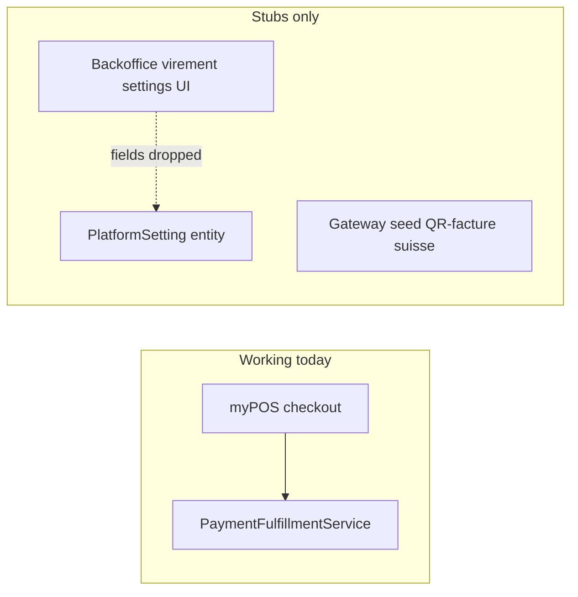
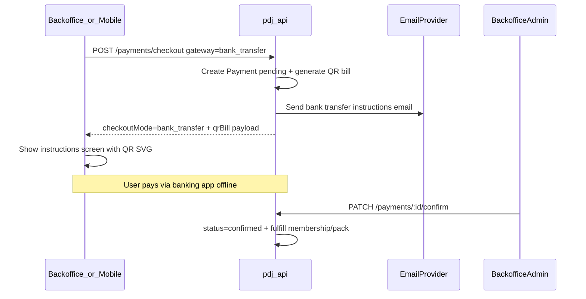

# Swiss QR Virement Payment — Implementation Plan

> Reference module: `/Users/mariusniemet/freelance/wiicode-documents/swiss-qr-bill-module`  
> Scope: API + backoffice + mobile (all payment purposes)

## Implementation checklist

- [ ] **backend-settings** — Add bank transfer columns (incl. creditor address) to PlatformSetting + migration + DTO/service + sync to payment_gateways
- [ ] **backend-qr-service** — Port SwissQrBillService to TypeScript (SPC payload, QR SVG, Swiss cross) using qrcode npm package
- [ ] **backend-checkout-confirm** — Extend PaymentsService for bank_transfer checkout, instructions endpoint, admin confirm/cancel, email template
- [ ] **backoffice-flow** — Wire settings address fields, gateway picker, bank-transfer instructions page, admin pending-payments reconciliation
- [ ] **mobile-flow** — Build mobile payment API layer, gateway selection, bank-transfer instructions screen, wire subscribe/frites checkout
- [ ] **testing-rollout** — End-to-end tests with SIX test IBAN across all purposes/clients; production credential checklist

---

## Reference module analyzed

Source: [`/Users/mariusniemet/freelance/wiicode-documents/swiss-qr-bill-module`](/Users/mariusniemet/freelance/wiicode-documents/swiss-qr-bill-module)

This Laravel module implements **manual bank transfer with Swiss QR-bill** (SIX Swiss Payment Standards 2022). It is **not** an instant payment gateway — there is no webhook from the bank.

| Reference component | What it does |
|---|---|
| [`SwissQrBillService.php`](/Users/mariusniemet/freelance/wiicode-documents/swiss-qr-bill-module/src/Services/SwissQrBillService.php) | Builds SPC payload, generates QR SVG with Swiss cross overlay |
| [`BankTransferController.php`](/Users/mariusniemet/freelance/wiicode-documents/swiss-qr-bill-module/src/Http/Controllers/BankTransferController.php) | Authenticated instructions page for a pending payment |
| [`BankTransferConfirmationMail.php`](/Users/mariusniemet/freelance/wiicode-documents/swiss-qr-bill-module/src/Mail/BankTransferConfirmationMail.php) | Email with IBAN + embedded QR (data URI) |
| [`bank-transfer.blade.php`](/Users/mariusniemet/freelance/wiicode-documents/swiss-qr-bill-module/resources/views/bank-transfer.blade.php) | Client UI: bank details, reference copy, QR scanner block |
| Gateway seeder | `bank_transfer` config: IBAN, BIC, creditor address, instructions |

**Reference module constraints (carry forward):**
- Reference type **`NON`** (reference in unstructured message `Ref: INV-...`) — no QRR/QR-IBAN auto-reconciliation
- **Manual admin confirmation** when bank transfer is received — no camt.054 import
- No PDF payment slip — web page + email QR only
- Creditor **street / postal code / city / country** required for valid SPC payload (currently missing from Plat du Jour settings UI)

---

## Current Plat du Jour state



Key gaps vs reference module:

- [`payments.service.ts`](../../pdj-api/src/payments/payments.service.ts) L45-47 rejects any gateway except `mypos`
- [`platform-setting.entity.ts`](../../pdj-api/src/settings/entities/platform-setting.entity.ts) has **no** `bankTransfer*` columns; [`update-settings.dto.ts`](../../pdj-api/src/settings/dto/update-settings.dto.ts) ignores backoffice fields sent from [`settings.ts`](../src/app/features/settings/settings.ts)
- [`Payment`](../../pdj-api/src/payments/entities/payment.entity.ts) has no `confirmedBy` field for admin reconciliation
- Mobile [`payment.tsx`](../../pdj-mobile/app/(tabs)/profile/(subscriptions)/payment.tsx) is cosmetic; paid flows bypass checkout
- CGV already promises bank transfer after order confirmation ([`cgv.json`](../../pdj-api/src/website/constants/legal-pages-seed/cgv.json))

**Reuse (do not rebuild):**
- Existing `Payment` entity + `Payment.generateReference()` (same `INV-YYYYMMDD-XXXXXX` format as reference module)
- Existing `PaymentGatewaySlug.BANK_TRANSFER` seed in [`payment-gateway.service.ts`](../../pdj-api/src/payments/payment-gateway.service.ts)
- Existing `PaymentFulfillmentService` — call it only after admin confirms payment
- Existing mailing stack ([`send.maling.ts`](../../pdj-api/src/mailing/send.maling.ts)) gated by `emailInvoiceEnabled`

---

## Target architecture



**Checkout modes after implementation:**

| Gateway | `checkoutMode` | Client behavior |
|---|---|---|
| `mypos` | `form_post` | Auto-submit hosted checkout (existing) |
| `bank_transfer` | `bank_transfer` | Navigate to instructions screen with QR |

---

## Phase 1 — Backend: settings persistence

### 1.1 Extend `PlatformSetting`

Add columns to [`platform-setting.entity.ts`](../../pdj-api/src/settings/entities/platform-setting.entity.ts):

- `bankTransferEnabled`, `bankName`, `bankAccountHolder`, `bankIban`, `bankBic`
- **New (required for SPC):** `bankStreet`, `bankPostalCode`, `bankCity`, `bankCountry` (default `CH`)
- `bankReferencePrefix` (default `INV`), `bankInstructionsFr`, `bankInstructionsEn`

Extend [`update-settings.dto.ts`](../../pdj-api/src/settings/dto/update-settings.dto.ts) + [`settings.service.ts`](../../pdj-api/src/settings/settings.service.ts) `updatePaymentSettings()`.

TypeORM migration for new columns.

### 1.2 Sync into `payment_gateways`

In [`payment-gateway.service.ts`](../../pdj-api/src/payments/payment-gateway.service.ts):

- Add `BankTransferGatewayConfig` type mirroring reference seeder shape
- Add `isBankTransferConfigured()` — requires IBAN + account holder + street + postal + city
- Add `syncBankTransferFromPlatformSettings()` called after settings save
- Set `requiresManualActivation: true` on seeded gateway (matches reference module)

### 1.3 Extend backoffice settings UI

Update [`settings.html`](../src/app/features/settings/settings.html) virement card:

- Add fields: **Rue**, **NPA**, **Ville**, **Pays** (creditor address for QR-bill)
- Clarify label: « QR-facture suisse » (align with gateway description)
- Update [`settings.service.ts`](../src/app/core/services/settings.service.ts) interfaces

---

## Phase 2 — Backend: port `SwissQrBillService`

Create [`pdj-api/src/payments/swiss-qr-bill.service.ts`](../../pdj-api/src/payments/swiss-qr-bill.service.ts) — direct TypeScript port of reference PHP logic:

| Method | Port from reference |
|---|---|
| `generate(payment, config)` | `SwissQrBillService::generate()` |
| `buildSpcPayload()` | SPC lines: header, IBAN, structured creditor address, amount, `NON` reference, `Ref: {reference}` message, `EPD` trailer |
| `generateQrSvg()` | Use npm `qrcode` package → SVG output |
| `addSwissCross()` | Same proportional SVG overlay (~14% box) |
| `getQrDataUri()` | Base64 SVG for email embedding |
| `formatIban()` | Groups of 4 |

Add dependency: `qrcode` (+ `@types/qrcode` if needed) in [`pdj-api/package.json`](../../pdj-api/package.json).

**Production safety:** reject checkout if IBAN is the SIX test IBAN (`CH4431999123000889012`) when `NODE_ENV=production`.

**Out of scope (documented):** QRR structured references, QR-IBAN, camt.054 auto-matching, PDF slip generation.

---

## Phase 3 — Backend: checkout + instructions API

### 3.1 Refactor `PaymentsService.createCheckout()`

In [`payments.service.ts`](../../pdj-api/src/payments/payments.service.ts):

1. Extract shared pending-payment creation (already mostly inline)
2. Branch on gateway:
   - `MYPOS` → existing flow, `checkoutMode: 'form_post'`
   - `BANK_TRANSFER` → validate config → generate QR bill → send email → return:

```typescript
{
  checkoutMode: 'bank_transfer',
  payment,
  returnToken,
  qrBill: { svg, payload, iban, bic, amount, reference, creditor, instructions },
  instructionsUrl: `/payments/bank-transfer/${payment.id}`,
}
```

3. Send [`BankTransferConfirmationMail`](../../pdj-api/src/mailing/templates/bank-transfer-confirmation.template.ts) via existing `sendEmail(..., 'invoice')` when `emailInvoiceEnabled`

### 3.2 Instructions endpoint

Add to [`payments.controller.ts`](../../pdj-api/src/payments/payments.controller.ts):

- `GET /payments/bank-transfer/:id?token=` — owner-only (JWT or returnToken, same pattern as myPOS return-status)
- Returns payment summary + regenerated QR bill + bank config + instructions

### 3.3 Extend availability

Update `getAvailability()`:

```typescript
{ mypos: {...}, bankTransfer: { enabled, configured } }
```

---

## Phase 4 — Backend: manual admin confirmation

Reference module confirms payments manually when bank transfer arrives.

### 4.1 Schema

Add to [`payment.entity.ts`](../../pdj-api/src/payments/entities/payment.entity.ts):

- `confirmedById` (nullable UUID → admin User)
- Migration

### 4.2 Admin endpoints

In [`payments.controller.ts`](../../pdj-api/src/payments/payments.controller.ts) (admin-only):

| Route | Behavior |
|---|---|
| `PATCH /payments/:id/confirm` | If `pending` + `bank_transfer` → `confirmed`, set `paidAt`, `confirmedById` → `fulfillmentService.fulfill()` |
| `PATCH /payments/:id/cancel` | Mark `cancelled` if still pending |
| `GET /payments?gateway=bank_transfer&status=pending` | Already exists via admin list — filter in backoffice UI |

Idempotency: skip fulfillment if payment already confirmed (same guard as myPOS webhook).

---

## Phase 5 — Backoffice client

### 5.1 Payment service

Extend [`payment.service.ts`](../src/app/core/services/payment.service.ts):

- `bankTransfer` in availability response
- `createRestaurantCheckout(payload, gateway: 'mypos' | 'bank_transfer')`
- `getBankTransferInstructions(paymentId, token)`

### 5.2 Gateway selection in membership

In [`membership.ts`](../src/app/features/membership/membership.ts):

- Load `bankTransfer` from availability alongside myPOS
- When user picks virement → checkout with `gateway: 'bank_transfer'`
- Route to new instructions page instead of [`membership-checkout.ts`](../src/app/features/membership/membership-checkout.ts) form POST

### 5.3 New instructions page

Create `membership-bank-transfer.ts` (+ html/scss) porting layout from reference [`bank-transfer.blade.php`](/Users/mariusniemet/freelance/wiicode-documents/swiss-qr-bill-module/resources/views/bank-transfer.blade.php):

- Success banner (« commande enregistrée, virement en attente »)
- IBAN / BIC / beneficiary grid
- Highlighted reference + copy button
- QR SVG rendered via `[innerHTML]` (sanitized) or inline SVG binding
- Amount box + warning about reference in transfer message
- Link to poll payment status (optional: show « en attente de confirmation admin »)

### 5.4 Admin payment reconciliation UI

Extend [`payments.ts`](../src/app/features/payments/payments.ts) (or subscription detail):

- Filter pending `bank_transfer` payments
- **Confirmer le virement** button → `PATCH /payments/:id/confirm`
- Show reference, amount, user/restaurant, created date

---

## Phase 6 — Mobile client

### 6.1 Payment API layer

Create `pdj-mobile/features/payments/`:

- `usePaymentAvailability()`
- `useCreateCheckout()` — all three purposes + `gateway: 'bank_transfer'`
- `useBankTransferInstructions(paymentId, token)`

### 6.2 Replace mock payment screen

Refactor [`payment.tsx`](../../pdj-mobile/app/(tabs)/profile/(subscriptions)/payment.tsx):

- Show enabled gateways (myPOS/TWINT + virement QR)
- On virement selection → `POST /payments/checkout` → navigate to new screen

### 6.3 Bank transfer instructions screen

Create `app/(tabs)/profile/(subscriptions)/bank-transfer.tsx` (or shared `app/payments/bank-transfer.tsx`):

- Port reference UI using React Native (`ScrollView`, copy-to-clipboard via `expo-clipboard`)
- Render QR SVG using `react-native-svg` (parse SVG string) or show QR as WebView/image from API data URI
- Explain that subscription activates after admin confirms receipt

### 6.4 Wire paid subscription + frites flows

- Update [`use-subscribe-user.ts`](../../pdj-mobile/features/profile/hooks/use-subscribe-user.ts): paid plans → checkout, not legacy POST
- Replace direct [`use-purchase-frites-pack.ts`](../../pdj-mobile/features/hub/hooks/use-purchase-frites-pack.ts) for paid packs
- Keep free/default plans on legacy endpoints

### 6.5 i18n

Add FR/EN/DE/IT strings for bank transfer instructions (reference module is FR-only).

---

## Phase 7 — Email template

Create HTML template porting [`bank-transfer-confirmation.blade.php`](/Users/mariusniemet/freelance/wiicode-documents/swiss-qr-bill-module/resources/views/emails/bank-transfer-confirmation.blade.php):

- Order recap (amount, reference)
- Bank details block
- Embedded QR via data URI (test with Brevo + Kreativ Media SMTP)
- Subject: « Confirmation — Instructions de virement »

Respect `emailInvoiceEnabled` toggle in platform settings.

---

## Phase 8 — Testing and rollout

### Sandbox / test checklist

1. Configure bank transfer in backoffice with **SIX test IBAN** (`CH44 3199 9123 0008 8901 2`) + complete address
2. Create checkout for each purpose × each client:
   - Restaurant subscription (backoffice)
   - User subscription (mobile)
   - Frites pack (mobile)
3. Verify SPC payload starts with `SPC\r\n0200\r\n1\r\n...`
4. Scan generated QR with TWINT or bank app → amount, IBAN, beneficiary pre-filled
5. Confirm email received with QR embedded
6. Admin confirms payment → membership/pack fulfilled, invoice `PAID`
7. Verify myPOS flows unchanged
8. Verify double-confirm is idempotent

### Production checklist

- Replace test IBAN with real creditor account + address
- Enable `bankTransferEnabled` in settings
- Train admin on pending-payments reconciliation screen
- Update CGV if needed (already mentions virement)

---

## Key design decisions

| Decision | Rationale |
|---|---|
| Port reference SPC logic verbatim | Proven against SIX 2022 spec; avoids wrong QR payloads |
| `NON` reference type | Matches reference module v1; simpler (no QR-IBAN from bank) |
| Manual admin confirmation | Only mechanism in reference module; no bank webhook exists |
| Fulfillment on confirm, not checkout | Payment stays `pending` until money received — aligns with CGV |
| Creditor address in settings | Required by SPC; current UI only has IBAN/BIC |
| `checkoutMode: 'bank_transfer'` | Distinct from myPOS redirect/form-post; clients render instructions locally |
| Reuse existing `Payment` + fulfillment | Same pattern as myPOS port |

---

## Files to create or modify (summary)

**Create:**
- `pdj-api/src/payments/swiss-qr-bill.service.ts`
- `pdj-api/src/payments/types/bank-transfer-config.types.ts`
- `pdj-api/src/mailing/templates/bank-transfer-confirmation.template.ts`
- `pdj-api/src/migrations/*-AddBankTransferSettings.ts`
- `pdj-api/src/migrations/*-AddPaymentConfirmedBy.ts`
- `pdj-backoffice/src/app/features/membership/membership-bank-transfer.*`
- `pdj-mobile/features/payments/*`
- `pdj-mobile/app/.../bank-transfer.tsx`

**Modify:**
- [`payments.service.ts`](../../pdj-api/src/payments/payments.service.ts) — multi-gateway checkout, confirm/cancel
- [`payments.controller.ts`](../../pdj-api/src/payments/payments.controller.ts) — instructions + admin confirm
- [`payments.module.ts`](../../pdj-api/src/payments/payments.module.ts)
- [`payment-gateway.service.ts`](../../pdj-api/src/payments/payment-gateway.service.ts)
- [`payment.entity.ts`](../../pdj-api/src/payments/entities/payment.entity.ts)
- [`platform-setting.entity.ts`](../../pdj-api/src/settings/entities/platform-setting.entity.ts) + DTO + settings service
- [`settings.html`](../src/app/features/settings/settings.html) + [`settings.ts`](../src/app/features/settings/settings.ts)
- [`payment.service.ts`](../src/app/core/services/payment.service.ts)
- [`membership.ts`](../src/app/features/membership/membership.ts)
- [`payment.tsx`](../../pdj-mobile/app/(tabs)/profile/(subscriptions)/payment.tsx) + subscribe/pack hooks

**Out of scope (future):**
- QRR structured references + QR-IBAN
- camt.054 bank statement auto-reconciliation
- PDF Swiss payment slip (perforated bottom section)
- PayPal integration (separate plan exists)
